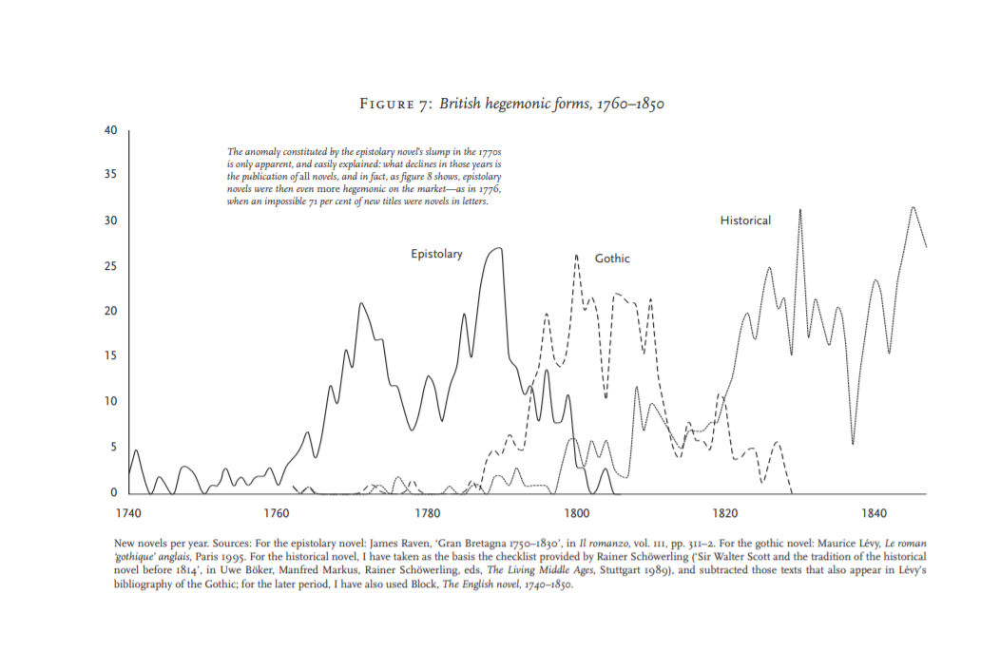
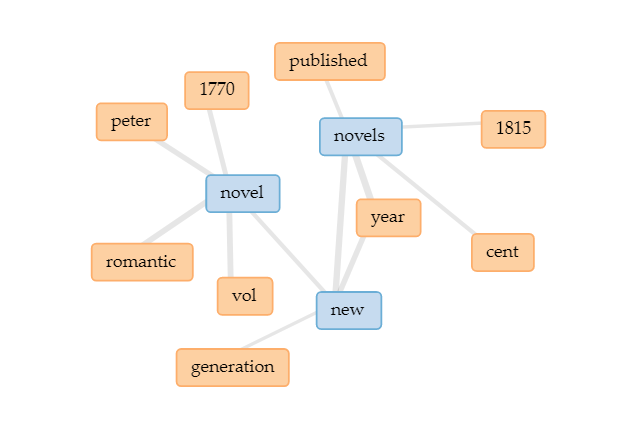

# More than the sum of its parts
## Diane Kohler - Response to Graphs, Maps, Trees by Franco Moretti

Moretti argues that literary genres disappear because of shifting generations. He illustrates this point with a graph (fig.7) showing the rising and falling popularity of British novels in the epistolary, gothic and historical genres. 

It appears that each genre has a period in time reaching peak popularity overshadowing the others. Moretti interprets this data as a genre turnover, a cyclic response to popularity as the new generation finds a different genre to captivate them from the previous. “Books survive if they are read and disappear if they aren’t: and when an entire generic system vanishes at once, the likeliest explanation is that its readers vanished at once.” However, when looking deeper into the data there are a few flaws. 

Moretti does not have a specific definition for what constitutes an epistolary, gothic or historical novel and instead uses data from what other scholars perceive as fitting into each category. The flaw here is that it omits the idea that novels can have interlocking genres or that genres can change definition overtime. Without a specific definition as to what counts as each genre the graph only represents the rising and falling popularity of novels categorized through bias. Furthermore by only taking novels recognized by scholars it limits the data even further. Drucker addresses this very problem of subjective data “what is a novel, what does "published" mean in this context (date of appearance, editing, composition, acquisition, review, distribution), and how was the "year" determined. Statistical methods come into play after these decisions have been made, counting objects whose identity was established by interpretative decisions.”(2011) By trying to eliminate bias from the data using the specifications and ‘interpretive decisions’ by other scholars it is hard to determine how accurate the graph really is. Moretti even says in his notes that “When specialists disagreed, I always opted for periodization arising out of the more convincing morphological argument” meaning he picks the data that suits his argument which adds even more bias and again limits data. 

Yet, even with the data being skewed I agree partly with Moretti on there being a shift within genres between generations. However, I do not agree that the shift in genre is entirely clear cut as he suggests, and instead this shift being more nuanced. I see this within current society today in the form of trends appearing and disappearing with each generation, outside of literary genre. This is because our world is more networked now and exchanges new ideas in the form of mimicry to connect rather than categorize. Deuze, Blank and Spears explore this idea and how media has become so entrenched in our lives that trends now represent a majority state of mind and a shared community. “Many if not most of the trends signaled here are neither exclusive to networked and mobile communication devices, nor are they uniquely supercharged by children or teenagers’ use of them. Historicizing the role media play in everyday life and analyzing the remediation of old and new devices, functions, and forms consistently confirms such a caveat to many claims made in the literature. Yet we argue that the media life perspective considers such developments regardless of whether one sees continuity or change; analyses of media can take a leap of faith towards a post-historical being in order to understand people's current mediatization.” (Deuze, Blank, Spears, 2012) 

In the form of novels there is usually one specific novel that sparks a trend and is made into a genre. Yet even within that genre there are many subgenres that make it a whole, and it is that specific combination of genre that makes it unique. In the case of the massive phenomenon of the Hunger Games novels, that series combined elements of dystopia, romance, action, tragedy, military, science fiction and arguably reality television. From this specific concoction of genres many more novels came out using the umbrella term “YA dystopia” capitalizing on Hunger Games’ success. The interconnected genres within the novel created its own genre altogether. My point is that neither a genre nor a trend is without interconnected parts, and mimicry is how both evolve throughout time. 

Moretti chose to study novels in the 18th and 19th centuries because “What Moretti says is, in fact, that those centuries — their literature — are not that well known,” (Clavert, 2014) but trying to uncover trends in literary genre without fully understanding the specific parts of the literature is difficult to do. 

For my visualization I have a connected term graph that focuses mostly on the term “novel”. 

The terms that surround it mostly have to do with historical context, and this represents how intertwined the focus of literature and history are for Moretti. He focuses a lot on time period and how novels reflect history based on genre popularity. However it shows how disconnected he is when it comes to the relation of novel and genre. Novels are connected directly to time instead of being an interpretation or a response to history. Literature is always an imitation and in my opinion a response to history, he does theorize that certain genres may have a basis in the mental state of the masses “amorous epistolary fiction being ill-equipped to capture the traumas of the revolutionary years, say – gothic novels being particularly good at it,” but believes that this is more due to the entire generational response to popularity instead. 

In short, I partly agree with Moretti in that there is a shift in genres and trends with each generation but it is not as clear cut with many genres reappearing in new forms and mimicking each other.  

### Works Cited:

Clavert, F. (2014). Reading Today. A New Companion to Digital Humanities, 8(4). Retrieved March 4, 2018.

Deuze, M., Blank, P., & Speers, L. (2012). A Life Lived in Media. A New Companion to Digital Humanities, 6(1). Retrieved March 4, 2018.

Drucker, J. (2015). Graphical Approaches to the Digital Humanities. A New Companion to Digital Humanities, 5(1), 238-250. doi:10.1002/9781118680605.ch17

Moretti, F. (n.d.). Graphs, Maps, Trees.
